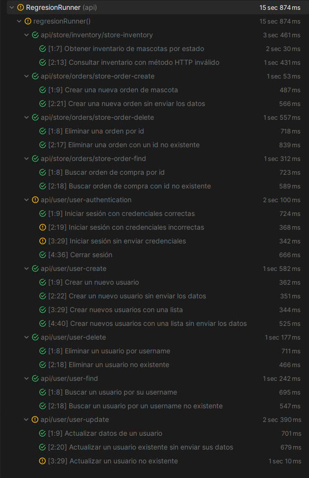

# 🧪 Proyecto de Automatización de Pruebas API Petstore - Escuela Testing

---

## 📊 Resumen de Resultados

- **Total de casos de prueba encontrados:** 20
- **Casos exitosos:** 17
- **Casos fallidos:** 3

📌 Los casos fallidos corresponden a comportamientos inesperados de la API y se detallan en la sección de análisis.

---

## 🛠️ Requisitos para Ejecutar el Proyecto

- **Java:** versión 17 o superior
- **Maven:** versión 3.11.0 o superior

---

## 📸 Evidencia del Reporte de Pruebas



---

## ❌ Análisis de Pruebas Fallidas

### 1️⃣ Inicio de sesión con credenciales incorrectas
- **Escenario:** Iniciar sesión con credenciales incorrectas.
- **Resultado esperado:** Código HTTP `401`.
- **Resultado obtenido:** Código HTTP `200`.
- **Observación:** La API permite el inicio de sesión aun cuando las credenciales son inválidas.

---

### 2️⃣ Inicio de sesión sin enviar credenciales
- **Escenario:** Iniciar sesión sin enviar credenciales
- **Resultado esperado:** Código HTTP `400`.
- **Resultado obtenido:** Código HTTP `200`.
- **Observación:** La API no valida la ausencia de credenciales.

---

### 3️⃣ Actualización de un usuario no existente
- **Escenario:** Actualizar un usuario no existente
- **Resultado esperado:** Código HTTP `404`.
- **Resultado obtenido:** Código HTTP `200`.
- **Observación:** La API responde como si la actualización se hubiese realizado correctamente.

---

## ▶️ Ejecución de las Pruebas

### 🧩 Ejecución desde Clases Java

#### 🔁 Regresión – Ejecutar todas las pruebas
1. Ubicar la clase `RegresionRunner.java`.
2. Clic derecho sobre la clase.
3. Seleccionar **Run 'RegresionRunner'**.

---

#### 🐞 Debug – Ejecutar pruebas aisladas
1. Agregar el tag `@debug` a los escenarios o features que se deseen ejecutar.
2. Ubicar la clase `DebugRunner.java`.
3. Clic derecho sobre la clase.
4. Seleccionar **Run 'DebugRunner'**.

---

### 💻 Ejecución mediante Línea de Comandos

#### 🔁 Regresión – Ejecutar todas las pruebas
```
mvn clean test -Dtest=RunnerTest -Dkarate.options="--tags @regression"
```
#### 🐞 Debug – Ejecutar pruebas aisladas
1. Agregar el tag `@debug` a los escenarios o features que se deseen ejecutar.
2. Ejecutar el siguiente comando:
```
mvn clean test -Dtest=RunnerTest -Dkarate.options="--tags @debug"
```